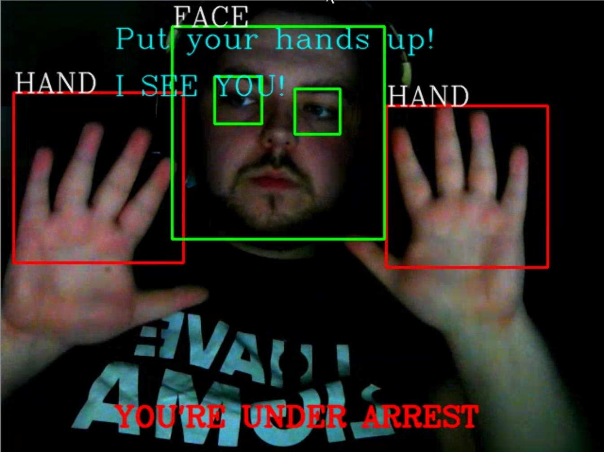
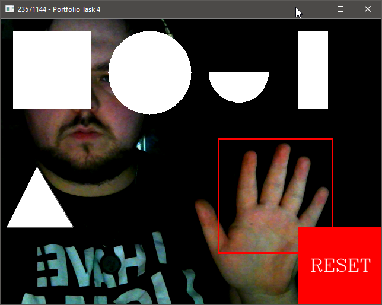
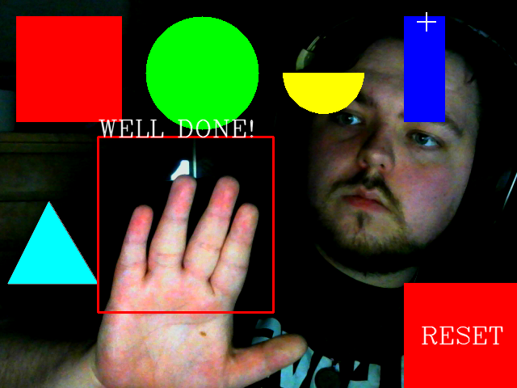

# A small collection of python / opencv programs i wrote in university.

This is a small collection of python opencv programs i wrote in my final year of my degree, playing around with the features of opencv in image-processing based interaction.

## Sample Screenshots

